# ꓘamerka GUI

## 终极物联网/工业控制系统侦察工具.

<p align="center"></p>

### 由 Shodan 提供支持 - 由 Binary Edge 和 WhoisXMLAPI 支持

## 用法

#### 1. 根据国家或坐标扫描面向互联网的工业控制系统、医疗和物联网设备.
#### 2. 从 WHOISXML、BinaryEdge 和 Shodan 被动收集情报或直接主动扫描目标.
#### 3. 借助设备和谷歌地图的指标，将设备定位到特定地点或设施（医院、污水处理厂、加油站、大学等）
#### 4. （可选，不推荐）猜测/暴力破解 或使用默认密码来访问设备。针对几个特定的物联网设备实施了一些漏洞利用.
#### 5. 向当地 CERT 报告关键基础设施中的设备.

## 特征
- 超过 100 台 ICS 设备
- 图库部分在一个地方显示每个收集的屏幕截图
- 交互式谷歌地图
- 谷歌街景支持
- 实现自己的漏洞利用或扫描技术的可能性
- 支持 xml 格式的 NMAP 扫描作为输入
- 查找设备的路线并更改位置
- 每次搜索的统计信息
- 在您的设备附近搜索 Flick 照片
- 容器的位置直接从设备上抓取，而不是基于 IP
- 一些设备在响应中返回提示或位置。它被解析并显示为有助于定位设备的指示器。

## 文章
https://www.offensiveosint.io/hack-the-planet-with-amerka-gui-ultimate-internet-of-things-industrial-control-systems-reconnaissance-tool/

https://www.offensiveosint.io/offensive-osint-s01e03-intelligence-gathering-on-critical-infrastructure-in-southeast-asia/

https://www.offensiveosint.io/hack-like-its-2077-presenting-amerka-mobile/

https://www.zdnet.com/article/kamerka-osint-tool-shows-your-countrys-internet-connected-critical-infrastructure/

https://www.icscybersecurityconference.com/intelligence-gathering-on-u-s-critical-infrastructure/

## 安装

### 要求
- beautiful soup
- python3
- django
- pynmea2
- celery
- redis
- Shodan paid account
- BinaryEdge (Optional)
- WHOISXMLAPI (Optional)
- Flickr (Optional)
- Google Maps API
- Pastebin PRO (Optional)
- xmltodict
- python-libnmap


**确保您的 API 密钥正确，并将它们放在主目录的 keys.json 中.**

### 运行命令
```
git clone https://github.com/woj-ciech/Kamerka-GUI/
pip3 install -r requirements.txt
python3 manage.py makemigrations
python3 manage.py migrate
python3 manage.py runserver
```

要想使其他主机能访问，需要修改kamerka目录下的settings.py文件
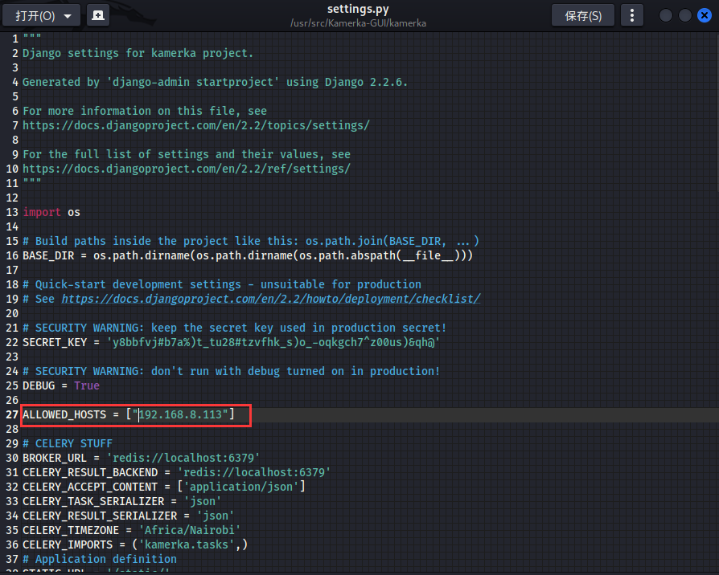

然后输入以下命令即可指定IP和端口
```
python manage.py runserver 192.168.8.113:8000
```

在新窗口（主目录中）运行
```
celery worker -A kamerka --loglevel=info
```

新版本 Celery 则
```
celery --app kamerka worker
```
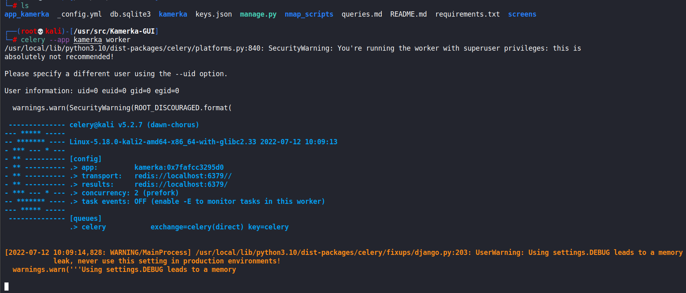

在新窗口中启动 redis
```
apt-get install redis
redis-server
```
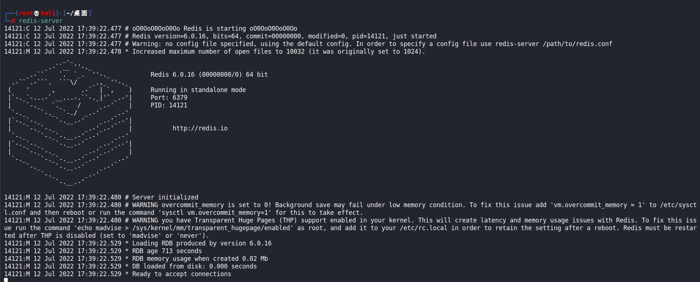

此时服务器可用 
```
http://localhost:8000/
```


## 搜索
### 在特定国家搜索工业控制设备
 

- “所有结果”复选框表示从 Shodan 获取所有结果，如果它被关闭 - 只会下载第一页 (100) 结果。
- “自己的数据库”复选框不起作用，但表明可以集成您自己的地理位置数据库。

### 搜索特定坐标的物联网
以“lat,lon”格式输入您的坐标，硬编码半径为 20 公里.
  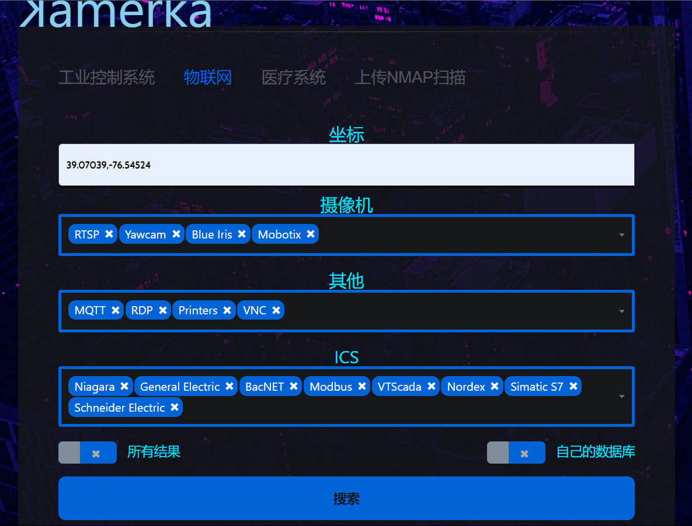

## 仪表板
   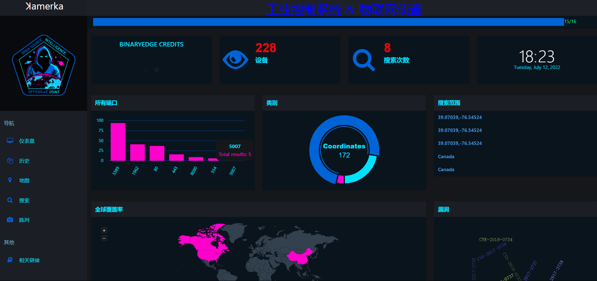

## 陈列
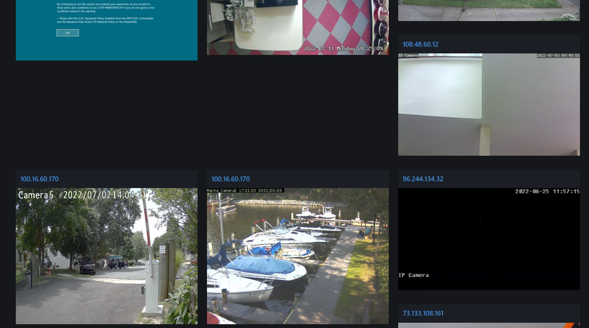

## 地图
### 城市地图
 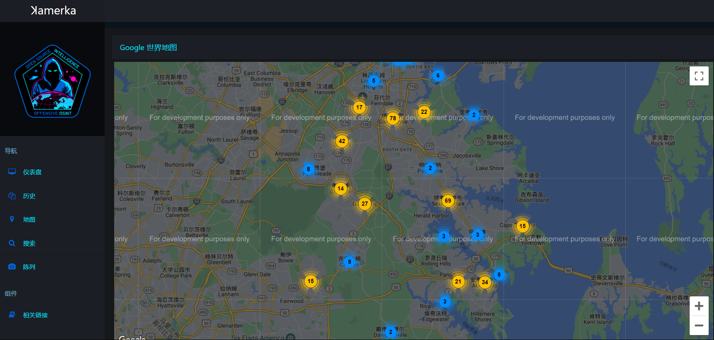

### 波兰的工业控制系统 - 约 2.5k 不同的设备


## 统计数据
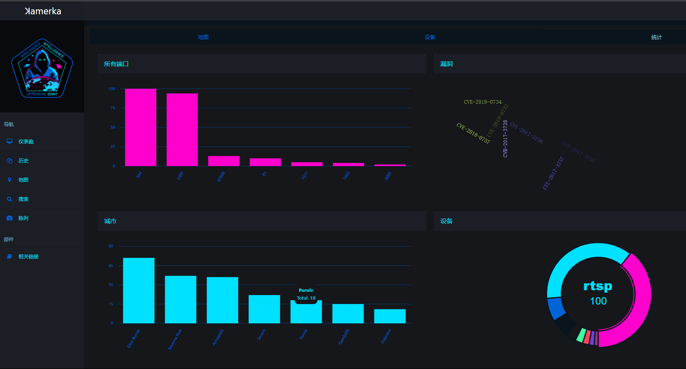

## 设备图
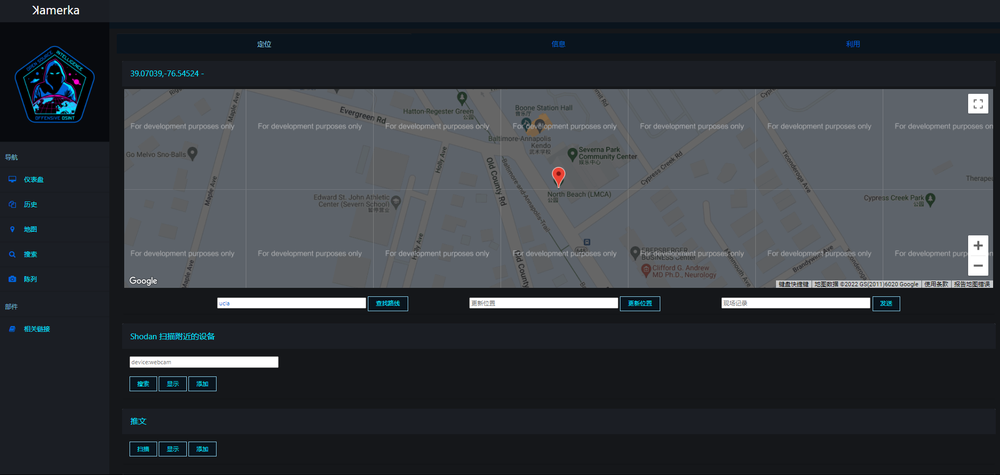

## 信息
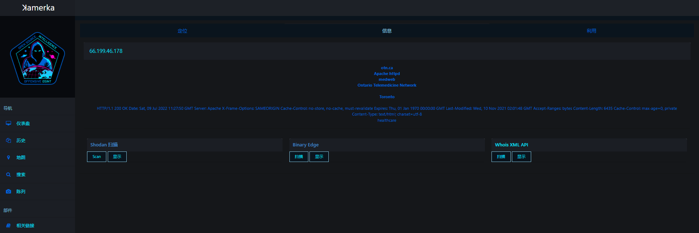

## 地理定位


## 扫描 & 漏洞利用 & 信息
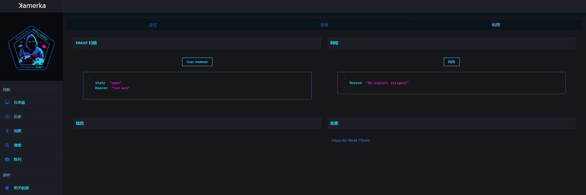

## 具有相应查询的受支持设备的完整列表
https://github.com/GhostWolfTeam/Kamerka-GUI-Chinese-translation/blob/main/queries.md

## NMAP 脚本
- atg-info
- codesys
- cspv4-info
- dnp3-info
- enip-info
- fox-info
- modbus-discover
- modicon-info
- omron-info
- pcworx-info
- s7-enumerate
- s7-info

## 漏洞利用
- CirCarLife SCADA 4.3.0 - Credential Disclosure
- VideoIQ - Remote file disclosure
- Grandstream UCM6202 1.0.18.13 - Remote Command Injection
- Contec Smart Home 4.15 - Unauthorized Password Reset
- Netwave IP Camera - Password Disclosure
- Amcrest Cameras 2.520.AC00.18.R - Unauthenticated Audio Streaming
- Lutron Quantum 2.0 - 3.2.243 - Information Disclosure
- Bosch Security Systems DVR 630/650/670 Series - Multiple Vulnerabilities


## 使用的组件
- Joli admin template - https://github.com/sbilly/joli-admin
- Search form - Colorlib Search Form v15
- country picker - https://github.com/mojoaxel/bootstrap-select-country
- Multiselect - https://github.com/varundewan/multiselect/
- Arsen Zbidniakov Flat UI Checkbox https://codepen.io/ARS/pen/aeDHE/
- icon from icons8.com and icon-icons.com
- Nmap Scripts from NMAP Script Engine and Digital Bond repository
- Exploits from exploit-db and routersploit

